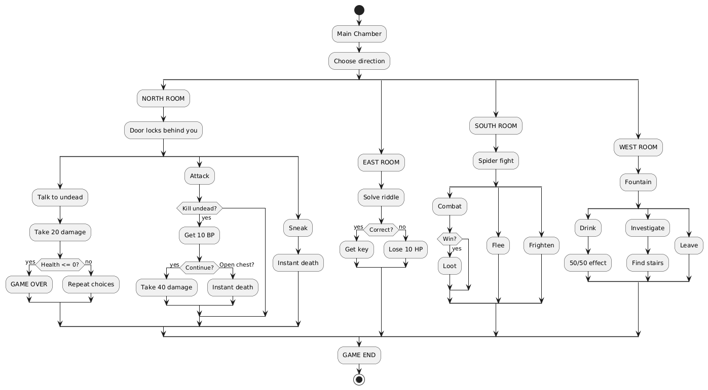

# Dungeon Crawler

A text-based dungeon crawler written in **Motorola 68000 assembly** and run in the **Easy68k** simulator. It was built in February 2025 as coursework for the Assembly and C module at SETU Carlow.

You create a miniature hero, pick a weapon, stock up on potions and choose a path through a four-room dungeon. Every room plays differently, and your choices affect both your health and your Bravery score.

## Gameplay

**Character creation**

- Choose between the **Mini Knight** (high health and armor, low speed) and the **Tiny Explorer** (moderate health, low armor, high speed).
- Pick one of five class-specific weapons with different damage values.
- Collect one to three health potions before entering the dungeon. Each potion restores 10 health.

**The dungeon**

From a central chamber you can enter four rooms:

| Room | Encounter | What you can do |
| --- | --- | --- |
| North | Undead adventurer | Talk, fight or sneak towards the chest. Winning opens the way to a boss room or the exit |
| East | Riddle challenge | Answer correctly for Bravery points and a key. A wrong answer costs health |
| South | Giant spider | Fight it, try to frighten it off (50% chance) or retreat to the hub |
| West | Cursed fountain | Drink for a 50/50 chance of gaining or losing 10 health, investigate, or walk away |

Combat uses weapon attacks, punches and kicks, each with its own damage value, and enemies hit back every round. A heads-up display shows your health and Bravery between encounters.

**Endings**

- **Win:** defeat the boss with enough health left to survive its aura attack.
- **Lose:** your health reaches zero, which also costs you 50 Bravery points.
- **Alternative endings:** escape the dungeon, solve the riddle or avoid the boss entirely.

## Flow chart

## Running it

1. Install [Easy68k](http://www.easy68k.com/).
2. Open `ProjectOption1_TextBased.X68` in the Easy68k editor.
3. Assemble the file (F9) and run it in the simulator (F9 again, then Run).
4. Play through the text prompts in the simulator's output window.

## Under the hood

- About 1,050 lines of 68k assembly, roughly 600 of which are message strings and ASCII art defined with `DC.B` and embedded CRLF bytes.
- Output, input and screen handling go through Easy68k `TRAP #15` tasks: string output, clear screen, single-character input, keypress wait and numeric display.
- Game state lives in word and byte variables: `HEALTH`, `BRAVERY`, `ENEMY_HEALTH`, `SELECTED_WEAPON_DMG` and `NUM_POTIONS`. Weapon damage values are defined as constants.
- Control flow is built from labelled subroutines such as `ROOM_SELECTION`, `NORTH_ROOM`, `EAST_ROOM`, `SOUTH_ROOM`, `WEST_ROOM`, `BOSS_ROOM`, `CHECK_DEAD`, `HUD` and `OFFER_POTION_USE`.

## Repository contents

| File | Description |
| --- | --- |
| `ProjectOption1_TextBased.X68` | Game source code |
| `GameScript.txt` and `GameScript.docx` | Room-by-room script of the encounters and outcomes |
| `GameFlowChart.png` | Flow chart of the game's paths |
| `TextGame_GameTrailer_C00166672.mp4` | Trailer showing the game in action |

## Known issues and future work

- Some ASCII art renders unevenly in the Easy68k output window, and a few input prompts are slightly misaligned.
- The game is a work in progress: the boss room and the later stages could be expanded with more enemies, items and endings.

## Author

Mark Mukiiza, Software Development student at SETU Carlow. [LinkedIn](https://www.linkedin.com/in/mukiiza-mark)
